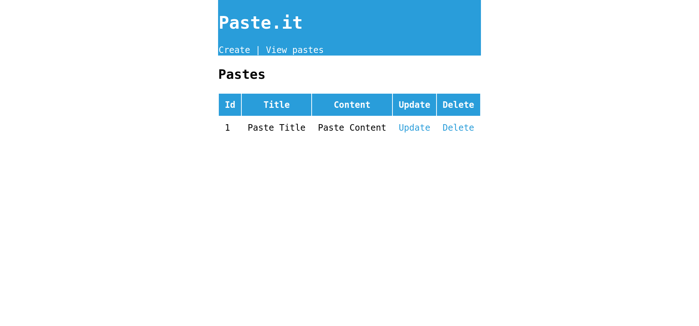
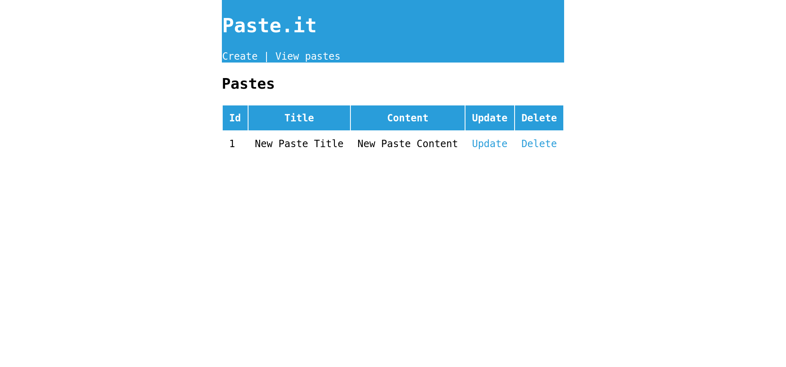

# Flask CRUD






## Setup MySQL database and dable

```sql
CREATE DATABASE IF NOT EXISTS egargo_crud;

CREATE TABLE IF NOT EXISTS egargo_crud.paste (
    id INT NOT NULL AUTO_INCREMENT,
    title VARCHAR(64) NOT NULL,
    content VARCHAR(8192) NOT NULL,
    PRIMARY KEY (id)
) ENGINE = InnoDB; 
```

## Setup Python environment

```bash
# Create virtual environment
python -m venv .env

# Activate virtual environment
source .env/bin/activate

# Install dependencies
pip install -r requirements.txt
```

## Run app

```bash
# Run
flask run
```

## Localhost Address

Test on [http://127.0.0.1:5000](http://127.0.0.1:5000)

## License

Provided by [C. Egargo](https://github.com/egargo) under the [MIT License](./LICENSE).
